<div align="center">

# 💹 Multi-Horizon Cash Flow Forecasting

[](https://git.io/typing-svg)


*Daily cash-flow forecasting for a B2B services firm — every model family judged on the same test window, with honest intervals, walk-forward backtests, and explanations a CFO can read.*

</div>

---

## 🎯 The problem

Treasury teams live on one question: **how much cash will we actually have — next week, next month, next quarter?** A point forecast isn't enough. They need to know how sure the number is, what breaks it, and what happens if a big client pays late.

This project answers all four, end to end:

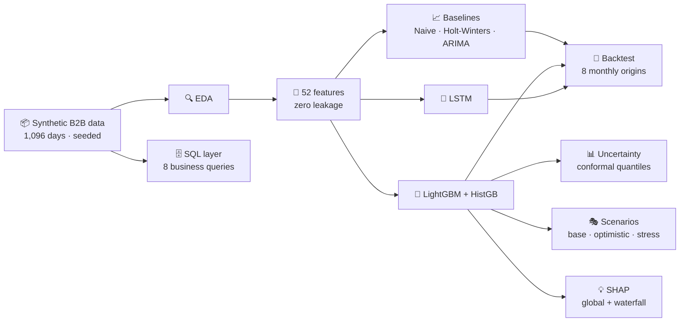

---

## 📦 The data

`data/cashflow_daily.csv` — daily, 2023-01-01 → 2025-12-31, all money in **₹ lakh**. Seeded (`rng = 42`), so every run reproduces it exactly.

| Column | Meaning |
|---|---|
| `cash_inflow_lakh` / `cash_outflow_lakh` | daily collections / payments |
| `net_cashflow_lakh` | inflow − outflow (the forecast target) |
| `cash_balance_lakh` | running balance from ₹12 cr opening |
| `headcount`, `billed_lakh` | business drivers |
| `fx_inr_usd`, `interest_rate` | macro drivers |
| calendar flags | weekend, holidays, payroll day (5th), month-end window, quarter-end … |

<details>
<summary><b>🧪 Planted behaviours (the traps a good model must survive)</b></summary>

- **Month-end collection push** — inflow ₹45.4L in the last-4-days window vs ₹31.3L normally
- **Weekend collapse** — inflow drops to ~₹14.5L on Sat/Sun
- **Payroll spikes** — outflow ~₹313L on the 5th vs ~₹13L on normal days
- **Q4 seasonality** in billings; **Jul-2024 acquisition** (+80 headcount); **Jun-2024 large client** (+₹180L/month billed)
- **Mar-2025 regime shift** — a collections process change lifts mean inflow ₹30.1L → ₹42.6L. Models trained only on old history break here.

</details>

---

## 🔬 Methodology — the full story, step by step

<details open>
<summary><b>Step 1–2 · Data + EDA</b> — trust nothing, verify everything</summary>

Generated the dataset, then checked it like a sceptic: 0 missing values, no duplicate dates, outlier scan (|z| > 3 on net → all 36 hits were payroll days, i.e. explainable, not errors). Confirmed the weekend dip, payroll spikes, Q4 seasonality and the Mar-2025 level shift **from the data, before modelling anything**.

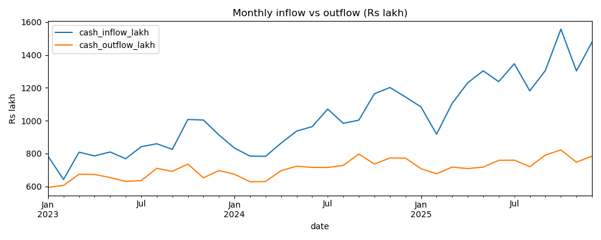
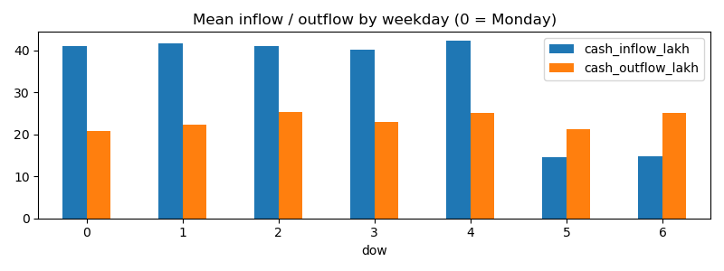
</details>

<details>
<summary><b>Step 3 · Feature engineering</b> — 52 features, zero leakage</summary>

Lags (1/7/14/30d) and rolling means/stds/min/max for inflow, outflow and net — **all shifted by at least one day**, so no feature ever peeks at its target. Cyclical calendar encodings (sin/cos of weekday, day-of-year, month), driver lags, FX momentum, and a `post_mar2025` regime flag. Strongest single signal: `is_payroll_day` (corr 0.93 with net) — honest, payroll really does dominate net cash flow.
</details>

<details>
<summary><b>Step 4 · Statistical baselines</b> — the bar every fancy model must beat</summary>

Naive seasonal (same weekday last week), Holt-Winters (trend + weekly seasonality), and ARIMA with the order chosen by AIC grid search → **(2,0,2)**. If a complex model can't beat these, the complexity isn't worth it.

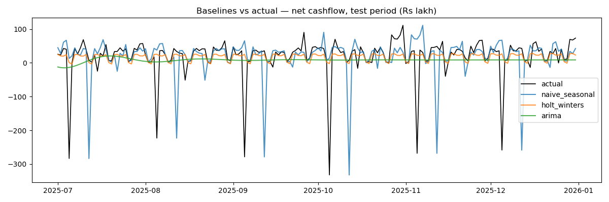
</details>

<details>
<summary><b>Step 5 · Machine learning</b> — LightGBM + HistGradientBoosting</summary>

Same 184-day test window as the baselines (fair fight). Plot twist worth keeping: LightGBM with **default** settings scored MAE 39.3 — *worse* than Holt-Winters. Only the regularized version (shallower trees, λ penalties, full-window training) reached 20.29. HistGradientBoosting won at 18.00. Default hyperparameters are not a strategy.

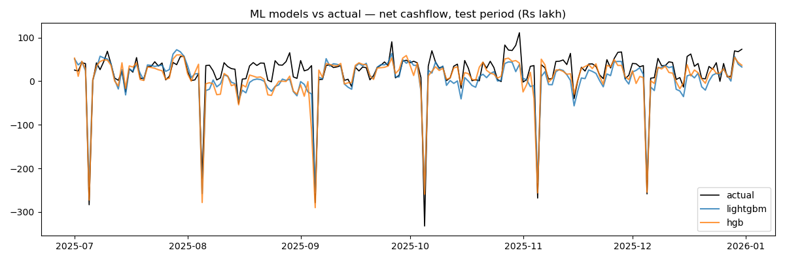
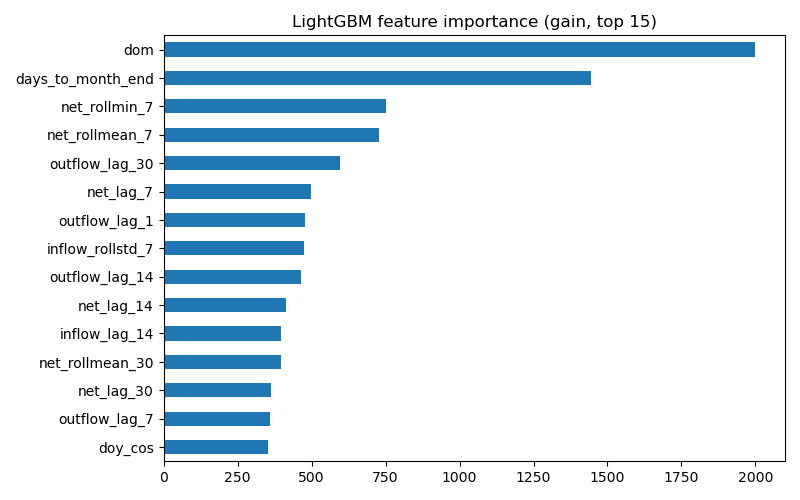
</details>

<details>
<summary><b>Step 6 · Deep learning</b> — 2-layer LSTM, 30-day lookback</summary>

Sequence-to-one PyTorch LSTM on scaled features, early stopping on a validation window (training curve saved as convergence evidence). Result: **MAE 14.38** — the best model. The ladder tells a clean story: statistical < ML < deep learning on this data.

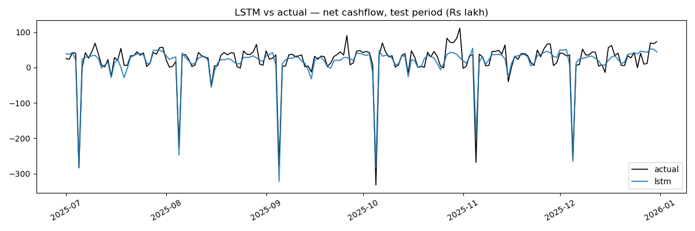
</details>

<details>
<summary><b>Step 7 · Uncertainty</b> — conformalized quantile regression</summary>

CFOs don't ask "what's Tuesday's net" — they ask "how much cash in 30 days, and how sure are you?" So the target is **cumulative** net over 7/30/90 days, with p10/p50/p90 bands. The first version (plain quantile regression) was badly miscalibrated — 30-day coverage 0.22 instead of 0.80. Fixed with **conformal calibration** on a held-out window: measure interval misses, widen every test interval by the 80th-percentile miss. Final coverage: **0.80 / 0.83** on 7/30-day.

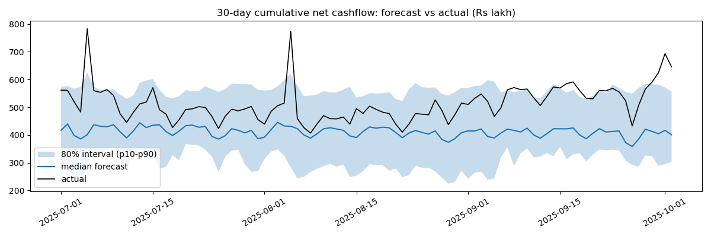
</details>

<details>
<summary><b>Step 8 · Retro testing</b> — walk-forward backtest</summary>

8 monthly origins (Feb→Sep 2025); at each, retrain on **all data available up to that date** and forecast 30 days — exactly how production would have behaved. LightGBM: mean MAE 17.29 (std 7.06). Both models show a small systematic under-forecast bias (~+₹8L/day) — stated, not hidden. Accuracy *improved* after the Mar-2025 regime entered training data: the regime flag does its job.

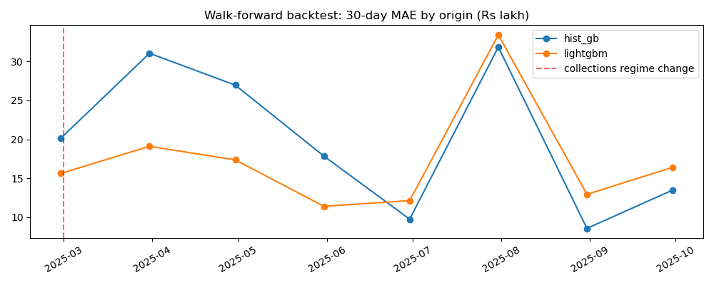
</details>

<details>
<summary><b>Step 9 · Scenario analysis</b> — what-if the board actually asks</summary>

90-day outlook under three scenarios. Base = LightGBM forecast. Levers work through **elasticities estimated from history** (₹1L billed → ₹0.0312L/day inflow) — because the trees barely split on `billed_lakh`, feeding the lever through them showed ~zero effect, and hiding that would be dishonest. Pessimistic adds a large client paying 2 weeks late in August.

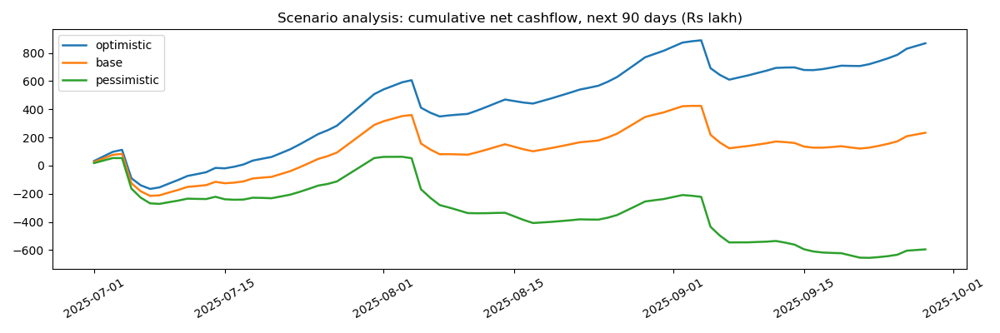
</details>

<details>
<summary><b>Step 10 · Explainability</b> — SHAP, global and local</summary>

Global: `dom`, 30-day rolling net mean and days-to-month-end drive the model — real business logic, learned. Local: waterfall plots for a payroll day, a month-end day, and the worst miss. Example: on 2025-10-05 the model predicted −₹252.1L vs actual −₹332.2L; `dom = 5` pushed the forecast down ₹148.4L from the ₹10.5L average. That's the whole story a CFO needs.

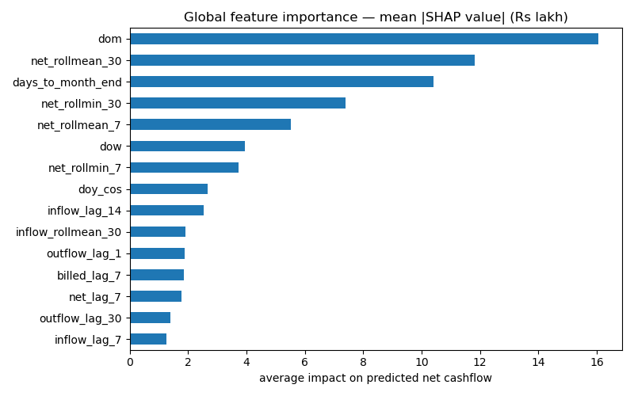
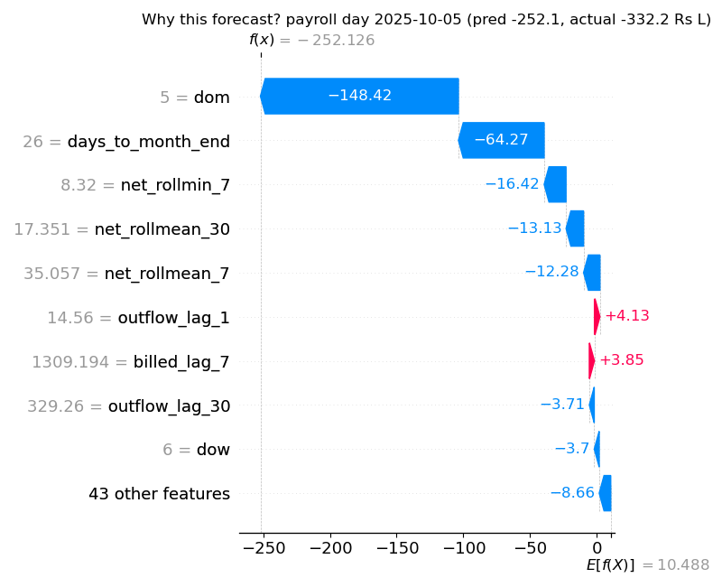
</details>

<details>
<summary><b>Step 11 · SQL layer</b> — the business-user interface</summary>

`sql/cashflow_analysis.sql` + `cashflow.db`: 8 queries covering the monthly close, forecast accuracy by month, collection efficiency, payroll burden, cash-runway alerts, driver stability by quarter, interval hit-rate, and the worst misses for the review meeting. The driver query surfaces the regime shift in pure SQL — collection ratio jumps 0.80 → 0.95 from 2025-Q2.
</details>

---

## 🏆 Results

| Model | MAE | RMSE | WAPE |
|---|---|---|---|
| Naive seasonal | 35.91 | 83.35 | 0.92 |
| ARIMA(2,0,2) · AIC-selected | 34.07 | 59.54 | 0.88 |
| **Holt-Winters** (best baseline) | 24.92 | 56.86 | 0.64 |
| LightGBM (tuned) | 20.29 | 25.99 | 0.52 |
| HistGradientBoosting | 18.00 | 25.64 | 0.46 |
| **LSTM** (best overall) | **14.38** | **19.42** | **0.37** |

| Horizon | Median MAE | 80% interval coverage |
|---|---|---|
| 7-day cumulative | 29.6 | **0.80** ✅ |
| 30-day cumulative | 102.1 | **0.83** ✅ |
| 90-day cumulative | 376.6 | 0.32 ⚠️ directional only |

| 90-day scenario | Cumulative net (₹ lakh) |
|---|---|
| Optimistic (billed +15%) | 868.0 |
| Base | 233.0 |
| Pessimistic (billed −15%, hiring +5%, Aug payment delay) | **−594.5** 🚨 |

---

## ⚠️ Honest limitations

- **Synthetic data.** Patterns mirror real B2B cash behaviour; the numbers aren't any real company's.
- **90-day intervals under-cover** (0.32 vs 0.80 target) — 90-day sums shift structurally after the Mar-2025 regime change. Kept in the repo as a documented limitation, not silently dropped.
- **Scenario levers** go through estimated elasticities, not a structural model — good for what-if, not for causal claims.
- **Small under-forecast bias** (~+₹8L/day) found in backtesting — the next iteration would correct it.

---

## 🚀 Run it

```bash
pip install -r requirements.txt
jupyter notebook cash_flow_forecasting.ipynb   # or open in VS Code, run all cells
```

56 code cells, 64 markdown cells, fully reproducible (seed 42). Plots save to `visuals/`, tables to `data/`.

```
cash-flow-forecasting/
├── README.md
├── requirements.txt
├── cash_flow_forecasting.ipynb   # the whole project, one notebook
├── data/                         # cashflow_daily.csv, features.csv, forecast tables
├── sql/                          # cashflow_analysis.sql (8 business queries)
└── visuals/                      # every plot in this README
```

---


